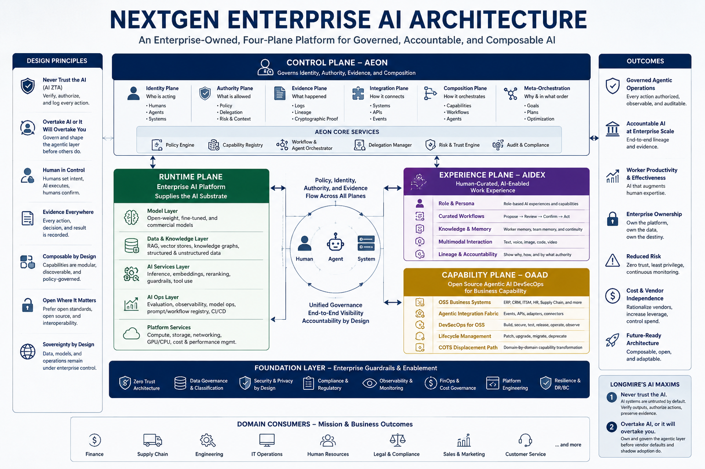

# enterprise-ai

Independent research on enterprise architecture for the agentic era — principal author **James D. Longmire** (Northrop Grumman Fellow, Chief Architect – Digital Ecosystems; ORCID [0009-0009-1383-7698](https://orcid.org/0009-0009-1383-7698)). One construct in the corpus, **Mx-Modes**, is co-authored with Micah Longmire ([ORCID 0009-0006-7608-9322](https://orcid.org/0009-0006-7608-9322)); see the per-construct attribution where it applies.

This corpus develops **enterprise architecture for the agentic era** across three layers: **Digital Ecosystems Architecture (DEA)** as the general-EA foundation — a three-baseline framework for coherent digital realization — an **AI specialization** that operationalizes [OrdSA (Ordinal Systems Architecture)](https://github.com/osa-ai-org/ordsa-ai) at enterprise scale through four AI-focused constructs (AEON, AIDEX, HCAE, OAAD), and a separate construct, **Mx-Modes**, that names the per-agent operating-envelope orientation the enterprise constructs presume. The thesis: enterprise architecture fails not through lack of design but through lack of coherence; the agentic-era control plane should be **enterprise-owned**, not vendor-rented; the four planes (control, runtime, experience, capability) should be composed as one architecture, ordered by OrdSA's authority/evidence construct; and individual agents within that architecture should be **oriented before they are executed**.

> *This work presents independent research and reflects the views of the author. It does not represent the position of any employer or program.*

---

*The four-plane architecture at a glance — Control (AEON) · Runtime · Experience (AIDEX) · Capability (OAAD). The full argument lives in the source documents below.*

---

## Architecture frame: Digital Ecosystems Architecture (DEA)

The corpus's general-EA foundation is **Digital Ecosystems Architecture** — a three-baseline framework for coherent digital realization, organized around three architecture disciplines and a single governing question per discipline:

| Baseline | Owned by | Governing question |
|---|---|---|
| **Digital Capability Baseline** | Enterprise Architecture | What must the enterprise be able to do to achieve its intended outcomes? |
| **Digital Technical Baseline** | Systems Architecture | How are those capabilities technically realized? |
| **Digital Operational Baseline** | Solutions Architecture | How is the resulting solution delivered, operated, governed, and sustained? |

Traceability binds the three: from business outcome to capability, capability to system, system to solution, solution to operation, and operation back to measured performance that revises the baselines above it. The framework holds that **enterprise architecture fails not by lacking design but by losing coherence across the disciplines that produce it**.

DEA is scoped to digitally-realized capabilities — those whose means of realization is substantially technical — and is intentionally general, not AI-specific. A forthcoming AI-specific extension, **AIDE-AF**, will bridge DEA's three baselines to the AI-focused constructs below. See [`Digital-Ecosystems-Architecture-Base.pdf`](docs/Digital-Ecosystems-Architecture-Base.pdf) for the foundational paper; the positioning papers cover DEA's relation to [UAF](docs/DEA-UAF-Positioning.pdf) and to the [DIB compliance stack](docs/DEA-DIB-Compliance-Positioning.pdf).

---

## AI specialization (AEON / AIDEX / HCAE / OAAD)

Within DEA's general frame, the corpus develops four AI-focused constructs that together compose into the agentic enterprise control plane. A forthcoming AI extension to DEA (AIDE-AF) will formally bridge the three-baseline framework to these constructs; until then, the relationship is articulated in prose across the AI specialization papers.

| Construct | Stands for | What it is |
|---|---|---|
| **AEON** | AI Enterprise Orchestration Nexus | The enterprise control plane for the agentic era. Six service planes — identity, authority, evidence, integration, capability composition, orchestration runtime. Enterprise IT-developed and sustained, not a vendor product. |
| **AIDEX** | AI Digital Experience | The worker-facing subdomain under AEON. The architecture that expresses HCAE operationally at the digital experience layer. One of nine peer subdomains. |
| **HCAE** | Human-Curated, AI-Enabled | The practice discipline AIDEX expresses. The practitioner curates AI-enabled output, remains the locus of judgment and accountability, contributes to institutional practice as an attributed and consenting participant. |
| **OAAD** | Open Source Software Agentic AI DevSecOps | A platform thesis: OSS + agentic AI + DevSecOps governance replaces the COTS business capability stack. The build-vs-buy calculus reframed by agentic AI. |

---

## Mx-Modes — the agent-orientation altitude

The four constructs above operate at the **enterprise altitude**: how an organization composes its AI control plane, runtime, experience subdomain, and capability platform. They presume — but until now did not name in the corpus — that each individual agent within that architecture is *oriented* before it executes.

**Mx-Modes** (architecturally designated **MxM** — multi-mode meta-harness) is the corpus's named construct at the **agent-orientation altitude**. It structures AI operation through five governing surfaces — **MIND** (reasoning discipline), **MORALS** (permission boundaries), **MISSION** (purpose and scope), **MEMORY** (continuity and reference), and **MEANS** (execution surface — tools, skills, workflows). A root `mode.md` file activates the operating posture; the model executes within the envelope the four discipline-bearing surfaces establish. Means implements; it does not grant permission.

The architectural claim:

> **AI behavior should be oriented before it is executed.**

Most AI implementations begin with capability — models, tools, APIs, plugins, automations — and try to constrain that capability afterward. Mx-Modes inverts the order: orientation first, then capability is loaded against an established posture. The result is categorical clarity over model behavior, not a claim about model capability or assurance.

Mx-Modes is **co-authored** with Micah Longmire ([ORCID 0009-0006-7608-9322](https://orcid.org/0009-0006-7608-9322), Sr. AI Architect). Per the bundling decision in [ADR-EA-0004](decisions/ADR-EA-0004-add-mx-modes-as-spine-construct.md), Mx-Modes is a spine construct at a different altitude than the AI-specialization four, not a fifth peer to them.

Source: [Mx-Modes Technical Architecture Reference (.docx)](docs/Mx-Modes-Technical-Reference.docx) / [`.pdf`](docs/Mx-Modes-Technical-Reference.pdf). Construct overview: [Mx-Modes Construct Infographic](infographics/Mx-Modes-Construct-Infographic.jpg).

---

## Suggested reading order

**Foundations (DEA — general EA frame):**

1. **[Digital Ecosystems Architecture: A Three-Baseline Framework for Coherent Digital Realization](docs/Digital-Ecosystems-Architecture-Base.pdf)** — read this first. The foundational paper: three baselines (Capability, Technical, Operational), three architecture disciplines, three governing questions, bidirectional traceability. Stands on its own as a general EA frame, independent of the AI specialization below.
2. **[DEA and the Unified Architecture Framework](docs/DEA-UAF-Positioning.pdf)** — positions DEA above UAF on the governance axis, below UAF on the description axis. Read after the base paper if your organization has invested in UAF.
3. **[DEA and the DIB Compliance Stack](docs/DEA-DIB-Compliance-Positioning.pdf)** — positions DEA beneath the DoD / CMMC / NIST compliance regime as a service layer. Read if you operate in defense or other regulated contexts.

**AI specialization (AEON / AIDEX / HCAE / OAAD):**

4. **[Enterprise Agentic AI Platform Strategy](docs/Enterprise-Agentic-AI-Platform-Strategy.pdf)** — the umbrella for the AI specialization. Argues for an enterprise-owned, four-plane platform architecture with a staged maturity model. Addressed to CIO / CTO.
5. **[AEON white paper](docs/AEON-White-Paper.pdf)** — the control plane in depth. Six service planes specified; Enterprise IT operating model; multi-classification deployment; phased path; minimal coherent subset.
6. **[AIDEX white paper](docs/AIDEX-White-Paper.pdf)** — the experience subdomain. Eight-axis modularity (presentation, persona, role, authority, context, memory, modality, lineage); HCAE framework; multi-backend topology; Claude Cowork as deployed reference.
7. **[OAAD Strategic Brief](docs/OAAD-Strategic-Brief-v5.pdf)** — the OSS-replaces-COTS platform thesis. Addresses the build-vs-buy reframing under agentic AI.
8. **[The Next Shape of the IT Business Capability Model](docs/OAAD-The-Next-Shape-of-the-IT-Business-Capability-Model.pdf)** — extends OAAD into the broader business-capability-model question. Reframes the capability map around owned vs. rented substrate, develops the sovereignty-constrained application, and distinguishes the pattern from its architectural neighbors.
9. **Companion decks** — [Enterprise Agentic Platform Architecture](docs/Enterprise-Agentic-Platform-Architecture-Deck.pdf) · [AIDEX](docs/AIDEX-Deck.pdf) · [AIDEX / AEON](docs/AIDEX-AEON-Deck.pdf).

**Agent orientation (Mx-Modes):**

10. **[Mx-Modes Technical Architecture Reference](docs/Mx-Modes-Technical-Reference.pdf)** — the agent-orientation construct. Read this after the enterprise-altitude argument is in hand, when descending from the enterprise control plane into per-agent operating structure. Co-authored with Micah Longmire.

---

## Infographics

Visual companions to the corpus. The full argument lives in the source documents; these are for orientation and at-a-glance reference.

**Foundations (DEA):**

- **[DEA — Three-Baseline Framework](infographics/DEA-Construct-Infographic.jpg)** — *"Digital Ecosystems Architecture: A Three-Baseline Framework for Coherent Digital Realization"* — the three baselines (Capability / Technical / Operational), three disciplines, traceability chain, ecosystem perspective, and the hinge to AIDE-AF (forthcoming AI extension)
- **[DEA and UAF — Positioning](infographics/DEA-UAF-Positioning-Infographic.jpg)** — *"Why a Coherence Framework Sits Above a Description Framework, and Depends On It"* — the altitude argument, baseline crosswalk, governance vs description axes
- **[DEA and the DIB Compliance Stack — Positioning](infographics/DEA-DIB-Compliance-Positioning-Infographic.jpg)** — *"Why Compliance Is the Governing Layer, and Architecture Is How an Enterprise Satisfies It Coherently"* — compliance authority paths (unclassified DIB + classified accreditation), DEA as the coherence layer beneath, traceability from obligation to evidence

**AI specialization (AEON / AIDEX / HCAE / OAAD):**

- **[NextGen Enterprise AI Architecture — landscape](infographics/NextGen-Enterprise-AI-Architecture-Infographic.png)** — the four-plane architecture in slide-friendly orientation (embedded above)
- **[NextGen Enterprise AI Architecture — portrait](infographics/EntAI-Architecture-Infographic.png)** — same architecture in tall format, expanded design principles, AEON core services, foundation layer, domain consumers, outcomes, and Longmire's AI Maxims
- **[Enterprise IT Agentic AI Platform Teams](infographics/EntAI-Platform-Team-Infographic.png)** — the four-platform operating model: AEON Control Plane Team, Enterprise AI Platform Team, AIDEX Experience Team, OAAD Capability Platform Team, and Domain AI Delivery Squads — with how the teams relate and the stand-up sequence

**Agent orientation (Mx-Modes):**

- **[Mx-Modes Construct Infographic](infographics/Mx-Modes-Construct-Infographic.jpg)** — the agent-orientation construct at a glance: five governing surfaces (Mind / Morals / Mission / Memory / Means), foundational rule, precedence model, lifecycle, example modes. The corpus construct that names what happens *before* an agent executes.

**Allied construct (OrdSA):**

- **[OrdSA Construct](infographics/OrdSA-Construct.png)** — the methodologically-allied [Ordinal Systems Architecture](https://github.com/osa-ai-org/ordsa-ai) framework that orders this corpus's AI specialization: 7 ordinal layers (O0 Enterprise Intent → O6 Outcome/Audit/Feedback) with the four governance principles and alignment with TOGAF, ArchiMate, UAF, NIST AI RMF. Canonical home is the OrdSA repo; this copy is bundled here for navigability.

---

## Document index

### Foundations (DEA)

| Document | Source | PDF |
|---|---|---|
| Digital Ecosystems Architecture — A Three-Baseline Framework for Coherent Digital Realization | [.docx](docs/Digital-Ecosystems-Architecture-Base.docx) | [.pdf](docs/Digital-Ecosystems-Architecture-Base.pdf) |
| DEA and the Unified Architecture Framework | [.docx](docs/DEA-UAF-Positioning.docx) | [.pdf](docs/DEA-UAF-Positioning.pdf) |
| DEA and the DIB Compliance Stack | [.docx](docs/DEA-DIB-Compliance-Positioning.docx) | [.pdf](docs/DEA-DIB-Compliance-Positioning.pdf) |

### AI specialization (AEON / AIDEX / HCAE / OAAD)

| Document | Source | PDF |
|---|---|---|
| Enterprise Agentic AI Platform Strategy | [.docx](docs/Enterprise-Agentic-AI-Platform-Strategy.docx) | [.pdf](docs/Enterprise-Agentic-AI-Platform-Strategy.pdf) |
| Enterprise Agentic Platform Architecture Deck | [.pptx](docs/Enterprise-Agentic-Platform-Architecture-Deck.pptx) | [.pdf](docs/Enterprise-Agentic-Platform-Architecture-Deck.pdf) |
| AEON white paper | [.docx](docs/AEON-White-Paper.docx) | [.pdf](docs/AEON-White-Paper.pdf) |
| AIDEX white paper | [.docx](docs/AIDEX-White-Paper.docx) | [.pdf](docs/AIDEX-White-Paper.pdf) |
| AIDEX deck | [.pptx](docs/AIDEX-Deck.pptx) | [.pdf](docs/AIDEX-Deck.pdf) |
| AIDEX / AEON deck | [.pptx](docs/AIDEX-AEON-Deck.pptx) | [.pdf](docs/AIDEX-AEON-Deck.pdf) |
| OAAD Strategic Brief v5 | [.pptx](docs/OAAD-Strategic-Brief-v5.pptx) | [.pdf](docs/OAAD-Strategic-Brief-v5.pdf) |
| OAAD — The Next Shape of the IT Business Capability Model | [.docx](docs/OAAD-The-Next-Shape-of-the-IT-Business-Capability-Model.docx) | [.pdf](docs/OAAD-The-Next-Shape-of-the-IT-Business-Capability-Model.pdf) |
| Mx-Modes Technical Architecture Reference *(co-authored with [Micah Longmire](https://orcid.org/0009-0006-7608-9322))* | [.docx](docs/Mx-Modes-Technical-Reference.docx) | [.pdf](docs/Mx-Modes-Technical-Reference.pdf) |

`.docx` and `.pptx` are the authoritative source; `.pdf` is provided alongside for browser-viewable rendering.

---

## Related work

This repository's corpus is **principal-authored by JD Longmire**; one corpus construct (Mx-Modes) is co-authored with Micah Longmire, as noted at the construct. Adjacent research by other authors that bears on the same broader program is **not absorbed into the corpus** but may be bundled for reading proximity. Currently:

- **[The Theseus Agent Thesis](docs/theseus-thesis/)** — by Micah Longmire ([bobbyhiddn](https://legate.studio/pub/bobbyhiddn)); develops *identity and memory as the permanents of AI agency* and introduces the Agent Identity Card Protocol (AICP). Operates at the agent-identity layer (per-agent identity + memory primitives), complementary to AI EA's enterprise control-plane focus and to OrdSA's per-agent execution-rights model. Canonical source at [legate.studio](https://legate.studio/pub/bobbyhiddn/the-theseus-agent-thesis); a verbatim archival snapshot lives in [`docs/theseus-thesis/`](docs/theseus-thesis/) with the author's attribution, disclaimer, and a note that the paper remains under the author's copyright (this repo's CC BY 4.0 license applies to JD-principal-authored corpus content; Mx-Modes is licensed CC BY 4.0 by both authors).

---

## Relation to OrdSA

The **AI specialization** of this corpus (AEON / AIDEX / HCAE / OAAD) is the canonical **enterprise-scale deployment of [OrdSA (Ordinal Systems Architecture)](https://github.com/osa-ai-org/ordsa-ai)** — the layered authority, evidence, and execution-rights construct for agentic systems. The AI specialization develops the concrete enterprise-architectural shape — control plane (AEON), runtime, experience subdomain (AIDEX), capability platform (OAAD) — that an enterprise builds when it operationalizes OrdSA at platform scale.

DEA and OrdSA address **different axes** and are orthogonal: DEA orders enterprise architecture by **coherence and accountability** across three architecture disciplines (Capability / Technical / Operational); OrdSA orders agentic systems by **authority, evidence, and execution rights** across seven ordinal layers (O0 → O6). An enterprise can apply DEA without OrdSA (for non-agentic work) or OrdSA without DEA's three-baseline framing (other EA structures are possible). The AI specialization applies both: DEA provides the architectural baselines and traceability discipline; OrdSA provides the authority and evidence ordering within agentic operations.

The alignment with OrdSA runs in three dimensions (within the AI specialization):

- **Structural** — AEON's six service planes and the four-plane platform map cleanly onto OrdSA's seven ordinal layers (O0 Enterprise Intent → O6 Outcome/Audit/Feedback). A worked methodological appendix mapping the two is planned as a future companion paper.
- **Visual** — the [OrdSA construct infographic](infographics/OrdSA-Construct.png) is bundled in this corpus's infographic shelf alongside the four AI-EA infographics, since the AI-EA architecture cannot be read coherently without the construct it deploys.
- **Operational** — this corpus has adopted OrdSA's PR-first + ADR-as-PR governance ([ADR-EA-0001](decisions/ADR-EA-0001-adopt-ordsa-development-process.md)); the framing reflected here is ratified in [ADR-EA-0002](decisions/ADR-EA-0002-reframe-as-ordsa-exemplar.md).

For framework-builders evaluating OrdSA itself — read the [OrdSA construct repo](https://github.com/osa-ai-org/ordsa-ai) first. This corpus is the deployment view, not the construct.

---

## Governance

enterprise-ai operates under OrdSA-style governance: framework-level changes flow as **ADRs ratified by PR**; refinements, new papers within scope, and infographic additions flow as **ordinary PRs**. `main` is the released, citable surface; all changes land via PR from `dev` or a feature branch.

- [`CONTRIBUTING.md`](CONTRIBUTING.md) — the workflow, the framework-vs-content distinction, and what triggers an ADR
- [`decisions/`](decisions/) — the ADR index and ratified records ([ADR-EA-0001](decisions/ADR-EA-0001-adopt-ordsa-development-process.md) adopts this process)

---

## Audience

**Primary** — CIO, CTO, Chief Architect, CISO at defense and highly regulated enterprises: those running classified or mission systems, those bound to demonstrate first-party auditability of all agentic operations, those whose sovereignty posture makes vendor governance over their own operations unacceptable.

**Secondary — DEA general-EA audience:** Enterprise Architects, Systems Architects, Solutions Architects in general digital-ecosystem practice. The DEA foundational papers stand on their own as a general EA framework, independent of the AI specialization.

**Secondary — AI specialization:** enterprise architects, identity engineering, and the subdomain engineering functions that compose into AEON.

**Tertiary** — agent architects and AI harness engineers who consume Mx-Modes at the per-agent altitude. The enterprise altitude (AEON / AIDEX / HCAE / OAAD) and the agent-orientation altitude (Mx-Modes) are linked but separately addressable; readers can enter either way depending on whether they are composing an enterprise platform or structuring an individual agent's operating envelope.

For an enterprise without those pressures, a rented vendor control plane may be the rational choice; the corpus says so explicitly rather than posing as a universal prescription.

---

## License

Licensed under [Creative Commons Attribution 4.0 International (CC BY 4.0)](LICENSE). You may share and adapt these works for any purpose, including commercial use, with appropriate attribution.

**Suggested citation:**

> Longmire, J. D. (2026). *[Document title]*. Enterprise architecture research corpus — Digital Ecosystems Architecture (DEA) + AEON / AIDEX / HCAE / OAAD + Mx-Modes. https://github.com/osa-ai-org/enterprise-ai

For Mx-Modes specifically, cite both authors:

> Longmire, J. D., & Longmire, M. (2026). *Mx-Modes: A Meta-Harness Framework for Multi-Mode AI Operation*. https://github.com/osa-ai-org/enterprise-ai (ORCIDs: 0009-0009-1383-7698 / 0009-0006-7608-9322)

---

## Contact

Correspondence: **jdlongmire@outlook.com** · ORCID [0009-0009-1383-7698](https://orcid.org/0009-0009-1383-7698)
